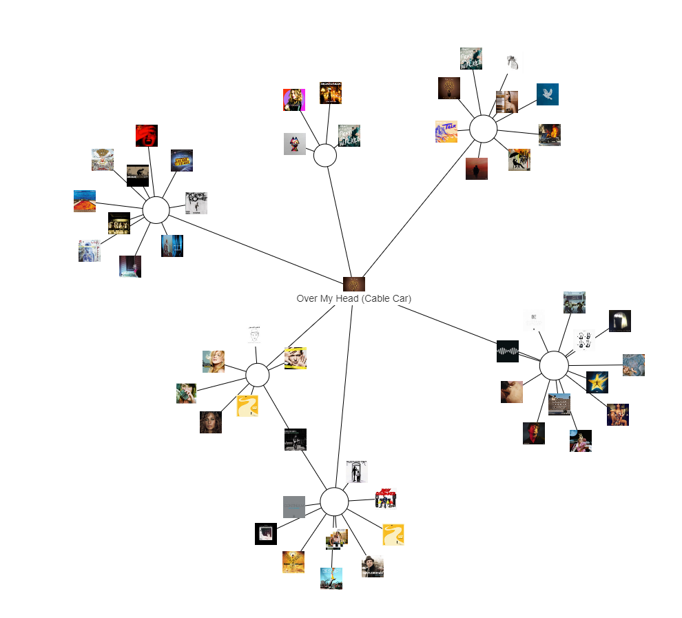

# Odkrivanje glasbe preko interaktivnega sprehajanja po grafu Spotify seznamov predvajanj.



## Vprašanje
Cilj seminarske naloge je bil vizualizirati podatkovno množico seznamov predvajanja na platformi Spotify. Orodje za interaktivno raziskovanje te množice - bipartidnega grafa povezanosti pesmi v sezname predvajanja - bi uporabniku lahko dalo intuitiven vpogled v to, kako ostali uporabniki kategorizirajo glasbo in s tem ponudilo nov način odkrivanja glasbe.

## Opis
Rezultat je aplikacija, ki omogoča sprehajanje po grafu vsebnosti pesmi v seznamih predvajanja in s tem odkrivanje nove glasbe. Na ekranu je naenkrat prikazana le okolica trenutno obravnavanega vozlišča, 
kar je ključno za preglednost in hitrost izvajanja. S klikom na druga vozlišča se nato lahko uporabnik premika po celotnem grafu, ponujena pa je tudi možnost predvajanja glasbe in preusmeritev na Spotify stran določene pesmi.
Vozlišča so v prostoru razporejene s tehniko "force-directed graphs", kjer so povezave med vozlišči simulirane kot vzmeti.

## Uporaba

Aplikacija je dostopna na https://matejbevec.github.io/spotify-graph-explorer.

Izvorna koda pa na https://github.com/MatejBevec/spotify-graph-explorer.

Navodila za uporabo so sledeča (prikazana tudi v aplikaciji sami):

```
This tool lets you visually explore public Spotify playlists in graph form. 

Click on a song or playlist node to focus on it (to view its neighborhood).

Hover above a song node to see the play and link button.
The play button plays a 30s clip of the song.
The link button opens the song's spotify page in a new tab

Hold Q to show titles for all nodes in the graph.

Press 1, 2 or 3 to pick the displayed number of hops.
The default 2 hops mean that the focused node's neighbors and their neighbors are displayed.
```
